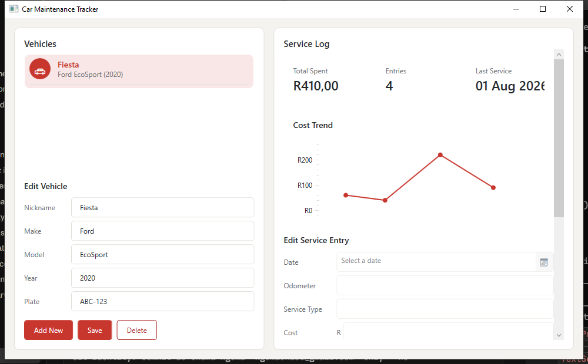

# Car Maintenance Tracker



A multi-vehicle service log tracker built with WPF (.NET 8) and MVVM. Track
vehicles and their service history — oil changes, repairs, inspections — with
SQLite-backed persistence, a cost-over-time chart per vehicle, and a custom
card-based UI with themed confirmation dialogs and toast notifications
(no default MessageBox popups or system dialog chrome).

## Getting started

1. Clone the repo:
   ```
   git clone https://github.com/Chawa-Ngoma/Car-Maintenance-Tracker.git
   ```
2. Open `CarMaintenanceTracker.sln` in Visual Studio, or from the repo root:
   ```
   dotnet build
   dotnet run --project CarMaintenanceTracker
   ```

Requires the .NET 8 SDK and Windows (WPF is Windows-only).

Currently in active development.
